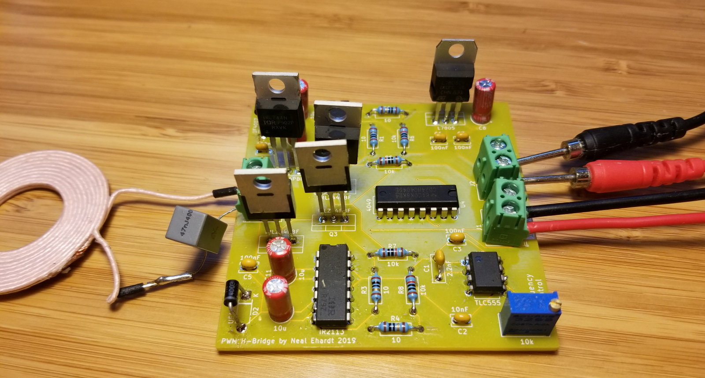

# PWM H-Bridge

This repository includes the KiCad project and Gerber files for a PCB that converts DC➡AC to transmitt wireless power through a coil. It generates a PWM signal in the KHz range to control an H-bridge. Frequency is adjustible with a knob.

This repo contains **rev. 2** which is _nearly identical_ to the above image, except I fixed an issue where the diodes were reversed.

I got the schematic from [DIY Wireless Energy Transfer System by Great Scott](https://www.instructables.com/id/DIY-Wireless-Energy-Transfer-System/). See that page for bill of materials and a highly informative video tutorial.

I copied Scott's schematic into KiCad 5.1.2 and laid out the PCB. I did **not** use the same identifier numbers as he did, but the part counts are identical. Part names are silkscreened on the PCB so it should be easy to assemble.

## Choosing capacitors for coils

The transmit and receive coils each need a capacitor nearby to make them resonate. The transmitter capacitor goes in series and the receiver capacitor goes in parallel.

Look in the coils' datasheets for the plot of Q-factor vs frequency, and choose a frequency that maximizes the Q of both coils. Also look up the coils' inductance (L).

For each coil, calculate `C = 1 / (4π²f²L)`. For example, `C = 1 / (4π²(150 KHz)²(24 µH))` = [47 nF](https://www.google.com/search?q=1%2F%284*pi%5E2*%28150+KHz%29%5E2*%2824+%C2%B5H%29%29+in+nanofarads).

Non-polarized capacitors must be used because the current is alternating.

## Ordering the PCB

You can upload [the Gerber zip](Plot/PWM-H-Bridge.zip) file to most PCB manufacturers. I had success ordering from Seeed Studio.

## Testing the transmitter

You need a 12V DC power supply (relatively weak) and a DC VCC supply (relatively strong). You can just use the same 12V supply for both.

If you're going to test with no receiver or a misaligned receiver, be sure to use a current-limited power supply for VCC. Otherwise, the transmitter will draw lots of current and you're likely to burn something up.

## Disclaimer

Electricity is dangerous and you might hurt yourself, but that's not my problem. Be careful, have fun, and please post any issues you have. You may freely modify and copy this work, in part or in whole, with or without attribution.
